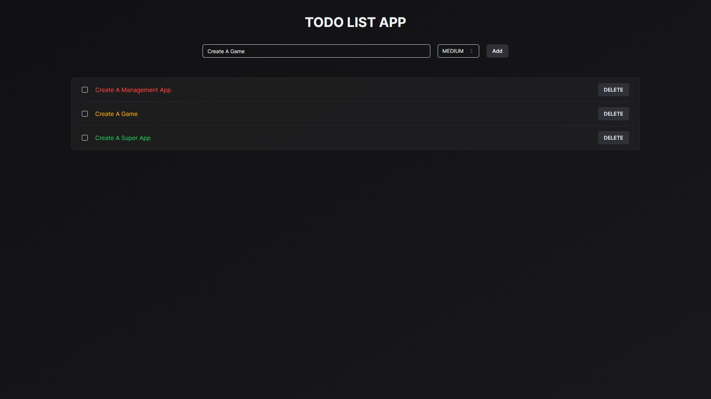

<!-- Improved compatibility of back to top link: See: https://github.com/othneildrew/Best-README-Template/pull/73 -->
<a name="readme-top"></a>
<!--
*** Thanks for checking out the Best-README-Template. If you have a suggestion
*** that would make this better, please fork the repo and create a pull request
*** or simply open an issue with the tag "enhancement".
*** Don't forget to give the project a star!
*** Thanks again! Now go create something AMAZING! :D
-->


<!-- PROJECT SHIELDS -->
<!--
*** I'm using markdown "reference style" links for readability.
*** Reference links are enclosed in brackets [ ] instead of parentheses ( ).
*** See the bottom of this document for the declaration of the reference variables
*** for contributors-url, forks-url, etc. This is an optional, concise syntax you may use.
*** https://www.markdownguide.org/basic-syntax/#reference-style-links
-->


<!-- PROJECT LOGO -->
<br />
<div align="center">
  <a href="https://github.com/ValentinoTriadi/RoadEye">
    
  </a>
  <h1>Todo List</h1>
  <p align="center">
    A Todo List Progressive Web App
    <br />
    <a href="https://github.com/ValentinoTriadi/TodoList"><strong>Explore the docs »</strong></a>
    ·
    <a href="https://github.com/ValentinoTriadi/TodoList/issues">Report Bug</a>
    <br/>
  </p>
</div>


<!-- TABLE OF CONTENTS -->
<details>
  <summary>Table of Contents</summary>
  <ol>
    <li>
      <a href="#about-the-project">About The Project</a>
      <ul>
        <li><a href="#built-with">Built With</a></li>
        <li><a href="#features">Features</a></li>
      </ul>
    </li>
    <li><a href="#requirement">Requirement</a></li>
    <li><a href="#usage">Usage</a></li>
    <li><a href="#Project-Status">Project Status</a></li>
    <li><a href="#Room-for-Improvement">Room for Improvement</a></li>
    <li><a href="#Acknowledgments">Acknowledgments</a></li>
  </ol>
</details>


<!-- ABOUT THE PROJECT -->
## About The Project


Simple Todo List Progressive Web App that can be used to manage your daily tasks. This project is built as a Progressive Web App (PWA) which means it can be installed on your device (Dekstop or Mobile).

<br/>


<p align="right">(<a href="#readme-top">back to top</a>)</p>


### Built With

[![Next][Next]][Next-url]
[![Tailwind][Tailwind]][Tailwind-url]

<br/>

### Features

* Simple Todo List
* Manage Todo

<p align="right">(<a href="#readme-top">back to top</a>)</p>


<!-- Requirement Dependencies -->
## Requirements

1. <a href="https://nodejs.org/en/download/package-manager">Node 20</a>  
    

<p align="right">(<a href="#readme-top">back to top</a>)</p>


<!-- USAGE EXAMPLES -->
## Usage

1. Clone the repo
   ```sh
   git clone https://github.com/ValentinoTriadi/TodoList.git
   ```
2. ```sh
   cd todo-app
   ```
3. ```sh
   npm install
   ```
4. ```sh
   npm run dev
   ```
5. Enjoy!

<p align="right">(<a href="#readme-top">back to top</a>)</p>


## Installation

1. Open ```https://todo-list-sandy-delta.vercel.app/```
2. Click on the `Install` button or `Add to Home Screen` button


<!-- PROJECT STATUS -->
## Project Status
Project status: _complete_ 
<br/>
<p align="right">(<a href="#readme-top">back to top</a>)</p>

<!-- ROOM FOR IMPROVEMENT -->
## Room for Improvement
- Improve Interface
- Add Detailed Information
<br/>
<p align="right">(<a href="#readme-top">back to top</a>)</p>

<!-- ACKNOWLEDGMENTS -->
## Acknowledgments
* [Valentino Chryslie Triadi](https://github.com/ValentinoTriadi)

[![LinkedIn][linkedin-shield-valen]][linkedin-valen]

<p align="right">(<a href="#readme-top">back to top</a>)</p>


<!-- MARKDOWN LINKS & IMAGES -->
<!-- https://www.markdownguide.org/basic-syntax/#reference-style-links -->
[Next-url]: https://nextjs.org/
[Tailwind-url]: https://tailwindcss.com/
[Next]: https://img.shields.io/badge/next.js-000000?style=for-the-badge&logo=nextdotjs&logoColor=white
[Tailwind]: https://img.shields.io/badge/tailwind-000000?style=for-the-badge&logo=tailwindcss&logoColor=white
[linkedin-shield-valen]: https://img.shields.io/badge/Linkedin-Valentino%20Triadi-000000?style=for-the-badge&logo=linkedin&logoColor=white
[linkedin-valen]: https://linkedin.com/in/valentino-triadi